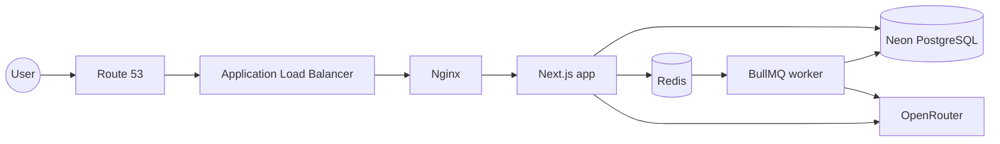
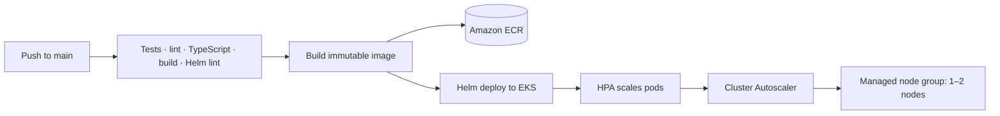

# Synapse

[](https://github.com/arnavsx3/synapse/actions/workflows/ci-cd.yml)
[](https://nextjs.org/)
[](https://aws.amazon.com/eks/)
[](#)

> A context-first chat arcade for turning documents into useful conversations.

Synapse lets a user paste text or upload `.txt`, `.md`, PDF, or `.docx` files,
then chat with an assistant grounded in that context. It is deliberately small
as a product and deliberately complete as a delivery exercise: the same code
that runs locally is tested, containerised, published to Amazon ECR, and
deployed to Amazon EKS through Helm and GitHub Actions.

## What makes Synapse useful

- Context ingestion with document extraction, chunking, offsets, and source metadata.
- Semantic retrieval through OpenRouter embeddings with keyword fallback when hosted inference is unavailable.
- Chat responses with visible retrieval sources instead of opaque context injection.
- Asynchronous embedding jobs through BullMQ and Redis.
- Explicit indexing states: `pending`, `processing`, `completed`, and `failed`.
- Graceful worker shutdown, retries, backoff, and inspectable failures.
- A compact two-page interface: the context console at `/` and chat at `/chat`.

## The system at a glance



The public path ends at Nginx. Redis, the worker, and the database are internal
service boundaries; they are never exposed through the public ingress.

## Delivery architecture



Pull requests run validation only. A successful push to `main` publishes both
the full commit SHA and `latest`, then deploys the full SHA to the development
cluster. The deployment never relies on a moving tag.

## Local development

### Prerequisites

- Node.js 20+
- npm
- Docker Desktop or Docker Engine with Compose
- A development PostgreSQL database, such as Neon
- An OpenRouter API key for hosted chat and embeddings

### Environment

```bash
cp .env.example .env
```

Set `DATABASE_URL` and `OPENROUTER_API_KEY` in `.env`. The separate
`LLM_API_KEY` and `EMBEDDING_API_KEY` variables are optional; when empty, the
application falls back to the OpenRouter key.

Never commit `.env`, database URLs, API keys, AWS access keys, or Kubernetes
Secret values.

### Run the application

```bash
npm install
npm run db:migrate
npm run dev
```

Run the embedding worker separately when using Redis:

```bash
npm run worker
```

Run the complete local boundary with Docker Compose:

```bash
docker compose up --build
```

Then open [http://localhost:3000](http://localhost:3000). Nginx is the only
application service exposed by the Compose stack.

### Quality checks

```bash
npm test
npm run lint
npx tsc --noEmit
npm run build
helm lint deploy/helm/synapse -f deploy/helm/synapse/values-dev.yaml
```

## AWS deployment

The live development shape is:

| Layer | Configuration |
| --- | --- |
| Region | `us-east-1` |
| EKS cluster | `synapse-dev` |
| Namespace | `synapse-dev` |
| ECR repository | `synapse` |
| Public domain | `synapes-dev.online` |
| Ingress | AWS Load Balancer Controller → internet-facing ALB |
| Storage | Default `gp3` EBS CSI class for Redis |
| Workload scaling | HPA: app 1–3, worker 1–2, Nginx 1–2 |
| Node scaling | Cluster Autoscaler: 1–2 managed nodes |

The domain spelling is intentionally `synapes-dev.online` because that is the
domain purchased for the demonstration environment. HTTPS is intentionally
not part of the current scope; the current ALB listener is HTTP.

The one-time bootstrap process is documented in
[`deploy/eks/README.md`](deploy/eks/README.md). After the cluster, secret,
storage class, and controllers exist, normal pushes to `main` deploy
automatically.

## CI/CD flow

The workflow lives at [`.github/workflows/ci-cd.yml`](.github/workflows/ci-cd.yml).

### Pull request

1. Install the locked npm dependencies.
2. Run tests, lint, TypeScript validation, and the production build.
3. Lint the Helm chart.

### Push to `main`

1. Repeat all validation checks.
2. Authenticate to AWS with GitHub OIDC and no stored AWS keys.
3. Build and publish the image to ECR under the commit SHA and `latest`.
4. Configure Kubernetes access to the `synapse-dev` cluster.
5. Run `helm upgrade --install` with the exact commit SHA.
6. Wait for the app, worker, and Nginx rollouts to complete.

The GitHub role is restricted to this repository's `main` branch. Its EKS
access is namespace-scoped to `synapse-dev`; it is not a cluster administrator.
See [`docs/github-actions.md`](docs/github-actions.md) for the AWS access
configuration and troubleshooting notes.

## Repository map

```text
app/                    Next.js pages and route handlers
lib/                    Database, RAG, AI, and queue modules
docker-compose.yml      Local Nginx, app, worker, and Redis stack
Dockerfile              Production application image
nginx/                  Local and container reverse-proxy configuration
deploy/helm/synapse/    Helm chart and environment values
deploy/eks/             EKS bootstrap, IAM policies, and autoscaling runbooks
docs/                   Architecture, operations, and delivery documentation
.github/workflows/      CI/CD automation
```

## Documentation

- [Architecture](docs/architecture.md)
- [GitHub Actions and ECR](docs/github-actions.md)
- [EKS deployment guide](docs/eks-deployment.md)
- [EKS bootstrap runbook](deploy/eks/README.md)
- [Helm chart reference](deploy/helm/synapse/README.md)
- [Environment values](docs/environments.md)

## Deliberate scope boundaries

Included: the application, Docker Compose, Amazon ECR, Amazon EKS, Helm, AWS
Load Balancer Controller, Route 53, workload and node autoscaling, and GitHub
Actions deployment automation.

Currently deferred: HTTPS/ACM, advanced security hardening, Terraform/OpenTofu,
ArgoCD/GitOps, managed Redis, advanced observability, disaster recovery,
multi-region deployment, and production-grade high availability.

For a short-lived demonstration environment, delete the EKS cluster and its
node group after testing. Also remove the ALB, Redis EBS volume, Route 53 hosted
zone, unused ECR images, and Synapse-specific IAM resources when the demo is
finished.
